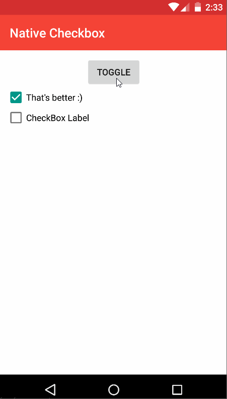
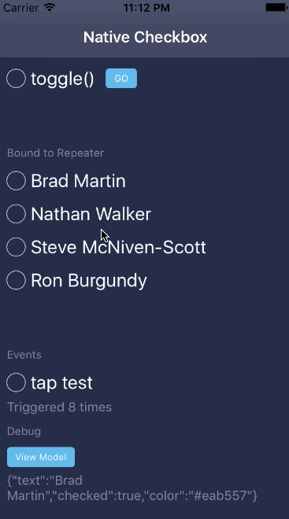

# NativeScript-CheckBox

[](https://www.npmjs.com/package/nativescript-checkbox)
[](https://www.npmjs.com/package/nativescript-checkbox)

# NativeScript CheckBox :white_check_mark:
A NativeScript plugin for the native checkbox widget.

#### Platform controls used: 
Android |   iOS
---------- | -------
[Android CheckBox](https://developer.android.com/reference/android/widget/CheckBox.html) | [BEMCheckBox](http://cocoapods.org/pods/BEMCheckBox) 


## Sample Usage

Android Sample |  iOS Sample
-------- | ---------
 | 

## Installation
From your command prompt/terminal go to your app's root folder and execute:

`tns plugin add nativescript-checkbox`

## Usage

###
```XML
<Page 
  xmlns="http://schemas.nativescript.org/tns.xsd" 
  xmlns:CheckBox="nativescript-checkbox" loaded="pageLoaded">
  <ActionBar title="Native Checkbox" />
  <StackLayout>
    <CheckBox:CheckBox checked="{{ checkProp }}" text="{{ myCheckText }}" fillColor="{{ myCheckColor }}" id="myCheckbox" />
    <CheckBox:CheckBox text="CheckBox Label" checked="false" />
  </StackLayout>
</Page>
```

### 
```TS
import { CheckBox } from 'nativescript-checkbox';
import { topmost } from 'ui/frame';

public toggleCheck() {
  let checkBox = topmost().getViewById('yourCheckBoxId');
  checkBox.toggle();
}

public getCheckProp() {
  let checkBox = topmost().getViewById('yourCheckBoxId');
  console.log('checked prop value = ' + checkBox.checked);
}

```

### Angular Usage Sample:

```typescript
import { CheckBox } from 'nativescript-checkbox';
import { registerElement } from "nativescript-angular/element-registry";
registerElement("CheckBox", () => require("nativescript-checkbox").CheckBox);

export class SomeComponent  {
    @ViewChild("CB1") FirstCheckBox: ElementRef;
    constructor() {}
    public toggleCheck() {
        this.FirstCheckBox.nativeElement.toggle();
    }

    public getCheckProp() {
        console.log('checked prop value = ' + this.FirstCheckBox.nativeElement.checked);
    }
}
```

```html
<StackLayout>
    <CheckBox #CB1 text="CheckBox Label" checked="false"></CheckBox>
    <Button (tap)="toggleCheck()" text="Toggle it!"></Button>
    <Button (tap)="getCheckProp()" text="Check Property"></
</StackLayout>
```

## Properties

- **checked** - boolean
- **text** - text to use with the checkbox
- **fillColor** - Color of the checkbox element

## API

- **toggle()** - Change the checked state of the view to the inverse of its current state.

## Css Styling

- **color** - set the text label color
- **font-size** - checkbox is sized to text from here  : default 15
- **border-width** - set the line width of the checkbox element: iOS only

## Demo Setup
* npm install tns-platform-declarations
* npm preparedemo
* npm run demo.ios
