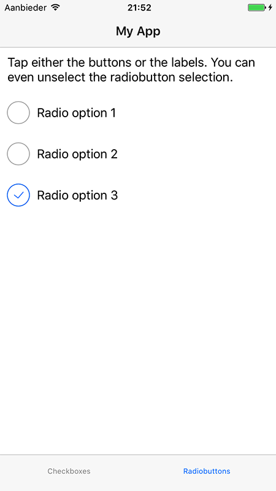

# NativeScript-CheckBox

[](https://www.npmjs.com/package/nativescript-checkbox)
[](https://www.npmjs.com/package/nativescript-checkbox)

# NativeScript CheckBox :white_check_mark:

A NativeScript plugin for the native checkbox widget.

#### Platform controls used:

| Android                                                                                  | iOS                                                  |
| ---------------------------------------------------------------------------------------- | ---------------------------------------------------- |
| [Android CheckBox](https://developer.android.com/reference/android/widget/CheckBox.html) | [BEMCheckBox](http://cocoapods.org/pods/BEMCheckBox) |

## Sample Usage

| Android Sample                     | iOS Sample                            |
| ---------------------------------- | ------------------------------------- |
|  |  |

## Installation

From your command prompt/terminal go to your app's root folder and execute:

#### NS 3.0+

`tns plugin add nativescript-checkbox`

#### NS < 3.0

`tns plugin add nativescript-checkbox@1.2.8`

## Usage

###

```XML
<Page
  xmlns="http://schemas.nativescript.org/tns.xsd"
  xmlns:CheckBox="nativescript-checkbox" loaded="pageLoaded">
  <ActionBar title="Native Checkbox" />
  <StackLayout>
    <CheckBox:CheckBox checked="{{ checkProp }}" text="{{ myCheckText }}" fillColor="{{ myCheckColor }}" id="myCheckbox" />
    <CheckBox:CheckBox text="CheckBox Label" checked="false" />
  </StackLayout>
</Page>
```

###

```TS
import { CheckBox } from 'nativescript-checkbox';
import { topmost } from 'ui/frame';

public toggleCheck() {
  let checkBox = topmost().getViewById('yourCheckBoxId');
  checkBox.toggle();
}

public getCheckProp() {
  let checkBox = topmost().getViewById('yourCheckBoxId');
  console.log('checked prop value = ' + checkBox.checked);
}

```

### Angular Usage Sample:

```typescript
import { TNSCheckBoxModule } from 'nativescript-checkbox/angular';

@NgModule({
	imports: [TNSCheckBoxModule]
	// etc.
})
export class YourModule {}

// component:
export class SomeComponent {
	@ViewChild('CB1') FirstCheckBox: ElementRef;
	constructor() {}
	public toggleCheck() {
		this.FirstCheckBox.nativeElement.toggle();
	}

	public getCheckProp() {
		console.log(
			'checked prop value = ' + this.FirstCheckBox.nativeElement.checked
		);
	}
}
```

```html
<StackLayout>
	<CheckBox #CB1 text="CheckBox Label" checked="false"></CheckBox>
	<button (tap)="toggleCheck()" text="Toggle it!"></button>
	<button (tap)="getCheckProp()" text="Check Property"></button>
</StackLayout>
```

### NativeScript-Vue Usage Sample

In your `main.js` (The file where the root Vue instance is created) register the element

```js
Vue.registerElement('CheckBox', () => require('nativescript-checkbox').CheckBox, {
	model: {
		prop: 'checked',
		event: 'checkedChange'
	}
});
```

And in your template, use it as:

```html
<check-box :checked="isChecked" @checkedChange="isChecked = $event.value" />
```
Use `checked` instead of `v-model`. [See #99](https://github.com/nstudio/nativescript-checkbox/issues/99).

## Properties

- **checked** - boolean
- **text** - text to use with the checkbox
- **fillColor** - Color of the checkbox element
- **boxType** - Either 'square' (default) or 'circle'. It's recommended to use 'circle' for radiobuttons. Note that plugin version 3.0.0 switched the default for iOS to 'square' for alignment with Android. Still want `circle` on iOS and `square` on Android? Just make the `boxType` value conditional.

## Events

- **checkedChange** - Use a reference to the CheckBox component to grab it's `checked` property when this event fires to see the new value.

## API

- **toggle()** - Change the checked state of the view to the inverse of its current state.

## Css Styling

- **color** - set the text label color
- **font-size** - checkbox is sized to text from here : default 15
- **border-width** - set the line width of the checkbox element: iOS only

## Styling [Android]

- **checkStyle** - set to the name of your drawable
- **checkPadding** - set the padding of the checkbox

Add the following to `app/App_Resources/Android/drawable/checkbox_grey.xml`

```xml
<?xml version="1.0" encoding="utf-8"?>

<selector xmlns:android="http://schemas.android.com/apk/res/android">
    <item android:state_enabled="false" android:state_checked="true" android:drawable="@drawable/ic_checkbox_checked_incomplete" />
    <item android:state_enabled="false" android:state_checked="false" android:drawable="@drawable/ic_checkbox_grey_incomplete" />
    <item android:state_checked="true" android:drawable="@drawable/ic_checkbox_checked_grey"/>
    <item android:state_checked="false" android:drawable="@drawable/ic_checkbox_grey" />
</selector>
```

## Radiobuttons, anyone?

Want to use radiobutton behavior for your checkboxes (only one option possible within a group)?
Set `boxType="circle"` and check out the second tab in the [Angular demo](demo-ng/), here's a screenshot:



## Demo Setup

- npm i
- npm run preparedemo
- npm run demo.ios

#### Contributors

<!-- ALL-CONTRIBUTORS-LIST:START - Do not remove or modify this section -->

| [<br /><sub>Brad Martin</sub>](https://bradmartin.net/) | [<br /><sub>Steve McNiven-Scott</sub>](https://github.com/sitefinitysteve) | [<br /><sub>Osei Fortune</sub>](https://github.com/triniwiz) | [<br /><sub>Nathan Walker</sub>](https://github.com/NathanWalker) |
| --------------------------------------------------------------------------------------------------------------------------------------- | ---------------------------------------------------------------------------------------------------------------------------------------------------------- | -------------------------------------------------------------------------------------------------------------------------------------------- | ------------------------------------------------------------------------------------------------------------------------------------------------ |


<!-- ALL-CONTRIBUTORS-LIST:END -->
